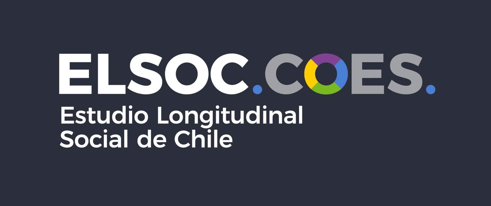

--- 
title: "Informe de Análisis de Propiedades Métricas ELSOC 2016-2022"
# subtitle: "Estudio Longitudinal Social de Chile"
author: "Equipo ELSOC"
site: bookdown::bookdown_site
documentclass: book
bibliography: ["bib/book.bib"]
csl: "bib/apa-no-ampersand.csl"
biblio-style: apalike
link-citations: yes
linkcolor: blue
geometry: "left=4cm, right=3cm, top=2.5cm, bottom=2.5cm"
fontsize: 12pt
linestretch: 1.5
toc-depth: 1
lof: True
lot: True
description: "Análisis Métrico ELSOC 2016-2022"
github-repo: "elsoc-coes/analisis_metrico_elsoc"
always_allow_html: true
editor_options: 
  markdown: 
    wrap: 72
---


# Presentación {-}


```{js, echo = FALSE}
title = document.getElementById('header');
title.innerHTML = '' + title.innerHTML
```

<div style="text-align: justify">

El Estudio Longitudinal Social de Chile (ELSOC) es una encuesta desarrollada para analizar intertemporalmente la evolución del conflicto y cohesión en la sociedad chilena, basándose en modelos conceptuales descritos en la literatura nacional e internacional que abordan dichas materias. Se orienta a examinar los principales antecedentes, factores moderadores y mediadores, así como las principales consecuencias asociadas al desarrollo de distintas formas de conflicto y cohesión social en Chile. Su objetivo fundamental es constituirse en un insumo empírico para la comprensión de las creencias, actitudes y percepciones de los chilenos hacia las distintas dimensiones de la convivencia y el conflicto, y como éstas cambian a lo largo del tiempo.

Esta encuesta fue diseñada por investigadores pertenecientes al Centro de Estudios de Conflicto y Cohesión Social (COES). COES está patrocinado por la Universidad de Chile y la Pontificia Universidad Católica de Chile, y cuenta con la Universidad Diego Portales y la Universidad Adolfo Ibáñez como instituciones asociadas. Si desea obtener más información sobre COES, visite la página web de COES (www.coes.cl/). COES es una iniciativa que desde 2013 cuenta con el financiamiento del Fondo de Financiamiento de Centros de Investigación en Áreas Prioritarias (FONDAP) de la Comisión Nacional de Investigación Científica y Tecnológica (CONICYT)1, organismo dependiente del Ministerio de Educación de Chile. El levantamiento de datos de ELSOC se licita públicamente cada 2 años, y ha sido adjudicado en todas sus mediciones al Centro MicroDatos de la Universidad de Chile (CMD).

El presente documento tiene como objetivo llevar a cabo un exhaustivo análisis métrico de la batería de indicadores y escalas que conforman el Estudio Longitudinal Social de Chile (ELSOC) a lo largo de las distintas olas realizadas hasta fecha. Para lograr dicho objetivo empleamos herramientas estadísticas fundamentales, las que se centran específicamente en dos aspectos clave: el análisis de correlaciones y el cálculo del coeficiente Alfa de Cronbach.


## Análisis de correlaciones {-}

El análisis de correlaciones constituye una parte esencial del análisis métrico, destinada a evaluar la naturaleza y la fuerza de las relaciones lineales entre las variables seleccionadas a través de las diferentes olas del ELSOC. Este proceso permitirá identificar patrones y tendencias que contribuirán a una comprensión más profunda de la interconexión entre las distintas dimensiones de nuestro estudio.

El análisis de correlación se lleva a cabo cuando uno o dos ítems conformar un concepto específico. Por ejemplo, en el módulo “Sociodemográfico” el concepto especifico “edad” es medido con un único ítem “Edad del entrevistado” a lo largo de cada una de las olas del estudio, por lo tanto, tendríamos correlaciones inter-ola del ítem. Por otra parte, cuando se tiene dos ítems por concepto se realiza la correlación entre ítems al interior de cada ola e inter-ola. Lo anterior busca verificar la consistencia de los conceptos específicos medidos con dos ítems a lo largo del tiempo.


## Cálculo del Coeficiente Alfa de Cronbach {-}

La fiabilidad de las mediciones del ELSOC será rigurosamente evaluada mediante el cálculo del coeficiente alfa de Cronbach. Este indicador proporciona una medida de la consistencia interna de la escala de medición utilizada, asegurando la confiabilidad y validez de los ítem que conformar los conceptos específicos del estudio.

A través de este análisis métrico, buscamos no solo explorar las asociaciones entre las variables sino también garantizar la solidez y la coherencia de nuestras mediciones. Este documento proporcionará una visión detallada de las mediciones empleadas en el ELSOC.

El cálculo de los coeficientes de Alfa de Cronbach se aplicará a los conceptos específicos que estén conformados por más de dos ítems, además este proceso se llevará en dos etapas. Primero, se realiza en cálculo de los coeficientes al interior de cada ola, estos con el objetivo de verificar la consistencia interna de las escalas. Posteriormente, se realizar correlaciones inter-olas de los valores promedios de los alfas de cada concepto especifico, con el objetivo de verificar el comportamiento de las escalas entre olas.


<!--chapter:end:index.Rmd-->


```{r setup, include=FALSE}

library(bookdown)
library(knitr)

knitr::opts_chunk$set(cache=FALSE, warning=FALSE, message=FALSE, echo=FALSE, fig.topcaption = TRUE, fig.align = 'center')
Sys.setlocale("LC_ALL","ES_ES.UTF-8")
```

```{r formats, include=FALSE }
table_format <- if (is_html_output()) {
  "html"
} else if (is_latex_output()) {
  "latex" 
}

fullw <- if (is_html_output()) {TRUE} else if (is_latex_output()) {FALSE}
fsize <- if (is_html_output()) {14} else if(is_latex_output()) {8}

ggplot2::theme_set(new = ggplot2::theme_test(base_family = "serif"))
options(knitr.kable.NA = '')

```


<!--chapter:end:01-preambulo.Rmd-->

# Análisis de correlaciones

<div style="text-align: justify">

```{r cargar-paquetes-2}
rm(list=ls())

library(knitr)
library(kableExtra)
library(gridExtra)
library(tidyverse)
library(sjmisc)
library(sjlabelled)
library(lubridate)
library(viridis)
library(statar)
library(bookdown)
library(readxl)
library(psych)
```

```{r cargar-datos-2}

load("../inputs/datos/ELSOC_Wide.RData")
lc <- read_xlsx("../inputs/libro_de_codigo/0A_Listado_Variables_Global_ELSOC_v2022_v4.xlsx",
                sheet = "2_Items_Total")

el <- elsoc_wide_2016_2022; elsoc_wide_2016_2022 <- NULL

el <- el %>%
  # Se seleccionan solamente aquellas variables que tengan valores numericos
  select_if(~is.numeric(.)) %>%
  # Algunas recodificaciones
  mutate(
    # Izquierda y derecha
    across(starts_with("c15"),~ifelse(. %in% c(11, 12),11,.)),
    # Se recodifican: 0=No vota; 1= Vota
    across(starts_with(c("c11","c43","c47","c50",
                         "c52","c54","c56")),
           ~ifelse(. %in% c(-999,-888,2,3),0,1))) %>%
  mutate_all(list(~ifelse(.<0,NA,.))) %>% ## Todos los valores perdidos pasan a NA.
  rename("m48_hijos_w02" = "m48_w02",
         "m48_hijos_w04" = "m48_w04",
         "m46_hogar_w02" = "m46_w02") %>%
  # Se renombran las variables de participación retrospectiva
  rename_at(vars(starts_with(c("c11","c43","c47","c50",
                          "c52","c54","c56"))),
            function(x)paste("part",x,sep="_"))

```


```{r correlaciones}

conceptos_grls <- unique(lc$concepto_general)
conceptos_eps <- unique(lc$Concepto_especifico_2)

vars <- list()
df <- NULL

for (i in 1:length(conceptos_grls)){
  df <- lc %>% filter(concepto_general == conceptos_grls[i])
  variables <- unique(df$codigo_longitudinal)
  variables.name <- unique(df$etiqueta)
  concepto.esp <- unique(df$Concepto_especifico)
  vars[[i]] <- c(`Nombre de la Variable`= variables.name,
                 `Codigo Longitudinal` = variables,
                 `Concepto Especifico_2` = concepto.esp)
  names(vars)[i] <- conceptos_grls[i] 
}

# Se crea una lista similar pero para los conceptos especificos

lista_conceptos_especificos <- list()

for (i in 1:length(conceptos_eps)){
  df <- lc %>% filter(Concepto_especifico_2 == conceptos_eps[i])
  variables <- unique(df$codigo_longitudinal)
  
  lista_conceptos_especificos[[i]] <- c(`Codigo Longitudinal` = variables)
  names(lista_conceptos_especificos)[i] <- conceptos_eps[i]
}


# Se hace un subset de la lista anterior.

vars.subset <- vars[setdiff(names(vars), c("Características encuestador/a",
                                            "Tabla Kish/Registro del Hogar",
                                            "Características entrevista",
                                            "Identificación de Casos y Datos",
                                            "Diseño Muestral del Estudio",
                                            "Autorizacion profundizacion estudio",
                                            "Acuerdo metodo seguimiento",
                                           "RUT"))]

lista_conceptos_especificos <- lista_conceptos_especificos[setdiff(names(lista_conceptos_especificos),
                                                                   c("Características encuestador/a",
                                                                     "Tabla Kish/Registro del Hogar",
                                                                     "Características entrevista",
                                                                     "Identificación de Casos y Datos",
                                                                     "Diseño Muestral del Estudio",
                                                                     "Autorizacion profundizacion estudio",
                                                                     "Acuerdo metodo seguimiento",
                                                                     "RUT",
                                                                     "Fecha entrevista",
                                                                     "Duración entrevista",
                                                                     "Supervisión entrevista"))]


# Se hace un segundo subset: se crean dos listas, una que contiene aquellos conceptos que tienen una variable,
# y otra lista que contiene a los conceptos que tienen más de una variable

concept.1 <- lista_conceptos_especificos[sapply(lista_conceptos_especificos,length)==1]
concept.2 <- lista_conceptos_especificos[sapply(lista_conceptos_especificos,length)>1] # A partir de aqui, hacer alfas.
                                                         # Y calcular las medias. Luego estas medias,
                                                         # Hacer correlaciones inter-olas.
                                                         # Excluir aquellas variables que no refieran a un
                                                         # concepto (por ejemplo, identificación política)

length(concept.1)+length(concept.2)==length(lista_conceptos_especificos) #para comprobar que el subset esté bien hecho
 
# En el caso de concept.1 solo se calcula la correlación entre olas.

cor.olas <- list() # lista para la correlación entre olas 
alfas <- list() # lista para los alfas de Cronbach
cor.in <- list() # lista para las correlaciones al interior de cada ola


### Mismas listas pero segmentadas por muestra

#### Muestra 1

cor.olas.1 <- list() # lista para la correlación entre olas 

alfas.1 <- list() # lista para los alfas de Cronbach
cor.in.1 <- list() # lista para las correlaciones al interior de cada ola

#### Muestra 2

cor.olas.2 <- list() # lista para la correlación entre olas 

alfas.2 <- list() # lista para los alfas de Cronbach
cor.in.2 <- list() # lista para las correlaciones al interior de cada ola


# Loop para las correlaciones inter-olas para los conceptos que tienen solo una variable

for (i in 1:length(concept.1)){
  data <- el %>%  select(starts_with(c(concept.1[[i]][1],"muestra"))) %>% 
    mutate_all(funs(ifelse(.<0,NA,.)))
  # Se crean df según muestras
  muestra.1 <- data %>% filter(muestra==1) %>% select(-muestra) %>% 
    select_if(colSums(is.na(.))<nrow(.))
  muestra.2 <- data %>% filter(muestra==2) %>% select(-muestra) %>% 
    select_if(colSums(is.na(.))<nrow(.))
  data <- data %>% select(-muestra)
  # se seleccionan solamente aquellos data que tengan más de una ola (se consideran ambas muestras juntas):
  if (length(data)>1){
    cor.olas[[i]] <- cor(data,use="pairwise.complete.obs")
  } else{
    cor.olas[[i]] <- "No aplica. Variable medida solamente en una ola."
  }
  names(cor.olas)[i] <- names(concept.1)[i]
  # se calculan correlaciones inter-ola por muestra
  ## Muestra 1
  if (length(muestra.1)>1){
    cor.olas.1[[i]] <- cor(muestra.1,use="complete.obs")
  } else{
    cor.olas.1[[i]] <- "No aplica. Variable medida solamente en una ola."
  }
  names(cor.olas.1)[i] <- names(concept.1)[i]
  ## Muestra 2
  if (length(muestra.2)>1){
    cor.olas.2[[i]] <- cor(muestra.2,use="complete.obs")
  } else{
    cor.olas.2[[i]] <- "No aplica. Variable medida solamente en una ola."
  }
  names(cor.olas.2)[i] <- names(concept.1)[i]
}

# Loop para las correlaciones inter-olas para todas las variables
# (se hace para extraer las correlaciones de algunos sociodemograficos)


cors.full <- list()
cors.full.1 <- list()
cors.full.2 <- list()

for (i in 1:length(lista_conceptos_especificos)){
  data <- el %>% 
    select(starts_with(c(lista_conceptos_especificos[[i]][1:length(lista_conceptos_especificos[[i]])],
                                       "muestra"))) %>% 
    mutate_all(funs(ifelse(.<0,NA,.))) %>%
    select_if(is.numeric)
  
  # Se crean df según muestras
  muestra.1 <- data %>% filter(muestra==1) %>% select(-muestra) %>% 
    select_if(colSums(is.na(.))<nrow(.))
  muestra.2 <- data %>% filter(muestra==2) %>% select(-muestra) %>% 
    select_if(colSums(is.na(.))<nrow(.))
  data <- data %>% select(-muestra)
  
  # se seleccionan solamente aquellos data que tengan más de una ola (se consideran ambas muestras juntas):
  if (length(data)>1){
    cors.full[[i]] <- cor(data,use="pairwise.complete.obs")
  } else{
    cors.full[[i]] <- "No aplica. Variable medida solamente en una ola."
  }
  names(cors.full)[i] <- names(lista_conceptos_especificos)[i]
  # se calculan correlaciones inter-ola por muestra
  ## Muestra 1
  if (length(muestra.1)>1){
    cors.full.1[[i]] <- cor(muestra.1,use="pairwise.complete.obs")
  } else{
    cors.full.1[[i]] <- "No aplica. Variable medida solamente en una ola."
  }
  names(cors.full.1)[i] <- names(lista_conceptos_especificos)[i]
  ## Muestra 2
  if (length(muestra.2)>1){
    cors.full.2[[i]] <- cor(muestra.2,use="pairwise.complete.obs")
  } else{
    cors.full.2[[i]] <- "No aplica. Variable medida solamente en una ola."
  }
  names(cors.full.2)[i] <- names(lista_conceptos_especificos)[i]
}


```


## Ejemplo

En construcción.


## Módulo 1: Caracterización Sociodemográfica


```{r correlaciones_sociodem}

# Correlaciones Inter olas de las variables sociodemograficas

knitr::kable(cors.full[["sexo"]],booktabs=T,
             caption="Correlación Inter-Olas de Sexo (Muestra 1 y 2)")

knitr::kable(cors.full[["edad"]],booktabs=T,
             caption="Correlación Inter-Olas de Edad (Muestra 1 y 2)")

knitr::kable(cors.full[["Educación"]],booktabs=T,
             caption="Correlación Inter-Olas de Educación (Muestra 1 y 2)")

knitr::kable(cors.full[["Educación"]],booktabs=T,
             caption="Correlación Inter-Olas de Educación (Muestra 1 y 2)")

knitr::kable(cors.full[["Ingresos"]],booktabs=T,
             caption="Correlación Inter-Olas de Ingreso (Muestra 1 y 2)")

knitr::kable(cors.full[["Horas destinadas al cuidado familiar"]],booktabs=T,
             caption="Correlación Inter-Olas de Cuidado Familiar (Muestra 1 y 2)")

knitr::kable(cors.full[["Previsión social"]],booktabs=T,
             caption="Correlación Inter-Olas de Previsión social (Muestra 1 y 2)")

knitr::kable(cors.full[["Sostenedor hogar"]],booktabs=T,
             caption="Correlación Inter-Olas de Sostenedor del hogar (Muestra 1 y 2)")

knitr::kable(cors.full[["Educación sostenedor"]],booktabs=T,
             caption="Correlación Inter-Olas de Educación del sostenedor del hogar (Muestra 1 y 2)")

knitr::kable(cors.full[["Clase y Estatus sostenedor"]],booktabs=T,
             caption="Correlación Inter-Olas de Clase y Estatus sostenedor (Muestra 1 y 2)")

knitr::kable(cors.full[["Ingreso familiar"]],booktabs=T,
             caption="Correlación Inter-Olas de Ingreso Familiar (Muestra 1 y 2)")

knitr::kable(cors.full[["Bienes 2"]],booktabs=T,
             caption="Correlación Inter-Olas de Bienes en el Hogar (Muestra 1 y 2)")

knitr::kable(cors.full[["Caracterización vivienda"]],booktabs=T,
             caption="Correlación Inter-Olas de Caracterización Vivienda (Muestra 1 y 2)")

knitr::kable(cors.full[["Tiempo residencia"]],booktabs=T,
             caption="Correlación Inter-Olas de Tiempo de residencia (Muestra 1 y 2)")

knitr::kable(cors.full[["Libros en hogar"]],booktabs=T,
             caption="Correlación Inter-Olas de Libros en el hogar (Muestra 1 y 2)")

knitr::kable(cors.full[["Estado civil"]],booktabs=T,
             caption="Correlación Inter-Olas de Estado civil (Muestra 1 y 2)")

knitr::kable(cors.full[["Religion"]],booktabs=T,
             caption="Correlación Inter-Olas de Religion (Muestra 1 y 2)")

knitr::kable(cors.full[["Transporte"]],booktabs=T,
             caption="Correlación Inter-Olas de Transporte (Muestra 1 y 2)")

knitr::kable(cors.full[["Deuda"]],booktabs=T,
             caption="Correlación Inter-Olas de Deuda (Muestra 1 y 2)")

knitr::kable(cors.full[["Nacionalidad"]],booktabs=T,
             caption="Correlación Inter-Olas de Nacionalidad (Muestra 1 y 2)")

knitr::kable(cors.full[["Etnia"]],booktabs=T,
             caption="Correlación Inter-Olas de Etnia (Muestra 1 y 2)")

```


## Módulo 2: Redes sociales e Interacciones inter-grupales

En construcción.


## Módulo 3: Territorio

En construcción.


## Módulo 4: Ciudadanía y Democracia

En construcción.


## Módulo 5: Legitimidad y desigualdad social

En construcción.


## Módulo 6: Conflicto social

En construcción.


## Módulo 7: Salud y bienestar

En construcción.


## Módulo 8: Género

En construcción.

<!--chapter:end:02-correlacion.Rmd-->

# Alpha de Cronbach

<div style="text-align: justify">

En construcción.


```{r cargar-paquetes-3}
rm(list=ls())
 
library(knitr)
library(tidyverse)
library(sjmisc)
library(sjlabelled)
library(ggrepel)
library(ggalluvial)
library(survey)
library(lubridate)
library(viridis)
library(statar)
library(tidyverse)

options(dplyr.summarise.inform = FALSE)

```

```{r cargar-datos-3}


```


## Ejemplo


## Módulo 1: Caracterización Sociodemográfica


## Módulo 2: Redes sociales e Interacciones inter-grupales


## Módulo 3: Territorio


## Módulo 4: Ciudadanía y Democracia


## Módulo 5: Legitimidad y desigualdad social


## Módulo 6: Conflicto social


## Módulo 7: Salud y bienestar


## Módulo 8: Género


<!--chapter:end:03-cronbach.Rmd-->

# Dudas y consultas

<div style="text-align: justify">

En caso de que tenga dudas sobre aspectos de la validación de los datos no cubiertos por el presente Informe de Análisis de Propiedades Métricas, las cuales no puedan ser resueltas por otros medios, puede comunicarse con el Equipo de Encuestas COES al correo electrónico [elsoc@coes.cl](elsoc@coes.cl). El equipo procesará su solicitud y tratará de contestar en el más breve plazo.

Para más información respecto a los datos de ELSOC, se puede revisar:

- [Manual Metodológico](https://manual-metodologico-elsoc.netlify.app/)
- Informe [Radriografía del Cambio Social en Chile 2016-2022](https://radiografia-cambio-social-2016-2022.netlify.app/)

<!--chapter:end:04-dudas-y-consultas.Rmd-->

---
output:
  pdf_document: default
  html_document: default
---

# Anexos {-}


<!--chapter:end:05-anexos.Rmd-->

